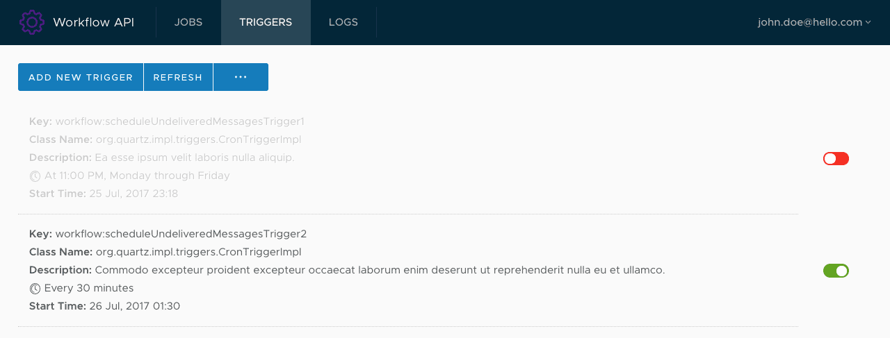

## Workflow API

Manage your running jobs and their assigned triggers — using Angular 5.x (and ngrx/store)



#### 0. Install everything
```sh
$ yarn && cd backend/ && yarn && cd ..
```

#### 1. Start the mock SocketIO server
```sh
$ cd backend && yarn start
```

#### 2. Start the frontend (HMR and AOT compilation, also available)
```sh
$ yarn start
$ yarn start:hmr
$ yarn start:aot
```

### TODO [Nice to Have]

#### A. deploy on Github Pages
```sh
$ yarn build -- --base-href https://raduchiriac.github.io/workflow/
$ angular-cli-ghpages --no-silent
```
